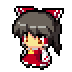
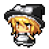
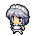
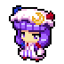

# RNGensokyo
### Play the game [here][gamelink]!

---

This is a gacha idle game featuring your favorite Touhou characters like:

... and many more! You can also customize their Equipments:

    > Pretend there's an image here displaying equipments

and combine it for higher stats!

    > Pretend there's an image showing combined items

There's even hourly/daily/weekly/monthly/yearly rewards for you to collect!

    > Pretend there's oh come on you get the point

And the features don't end here...

    > Insert bunch of other features we just spoiled, generic I know

So what are you waiting for? [Play now][gamelink]!

---

# Developer's Note

---

- YaNawMe
    > I just made this game with my friends. There's not really a clear goal for this or anything. We just treated is as a form of learning exercise for making a games and for learning different types of programming languages. I don't know if I or we have time to update this in the future but we accounted for that. I mean, we posted this here on github, I'm pretty sure someone out there might take an interest and further develop this game. If that happens, I'm more than happy for them to continue this (and maybe give me a slight hax on their gacha game **wink**) with credits or not. Anyways, enough talking, back to maintaining.

[gamelink]: https://www.youtube.com/watch?v=dQw4w9WgXcQ